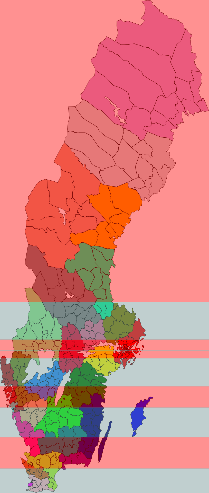

# befolkningsband

*ett litet program som ritar ut band för där folk bor*

i varje band bor 10% av sveriges befolkning, som man ser bor det inte så många i norrland och så finns det också ett supersmalt band runt stockholm.

om du vill ändra på hur många band du vill ha så är det bara att pilla på variablen `BANDS` i `main.py` filen. samma sak om du vill ändra på året, då är det bara att pilla på `YEAR` variablen.

- [ Digitala gränser (scb.se)](https://www.scb.se/hitta-statistik/regional-statistik-och-kartor/regionala-indelningar/digitala-granser/) *datan om var kommunerna ligger*

- [Befolkningstäthet (scb.se)](https://www.statistikdatabasen.scb.se/pxweb/sv/ssd/START__BE__BE0101__BE0101C/BefArealTathetKon/) *datan om hur många som bor kommunerna*

eftersom det inte framgår i datan var någonstans i kommunera folk bor så förutsätter programmet att alla i som bor i kommunen valt att bosätta sig precis i mitten. *folk brukar vilja bo lite mer utspritt*
